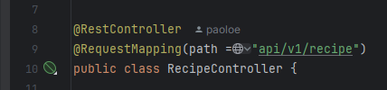
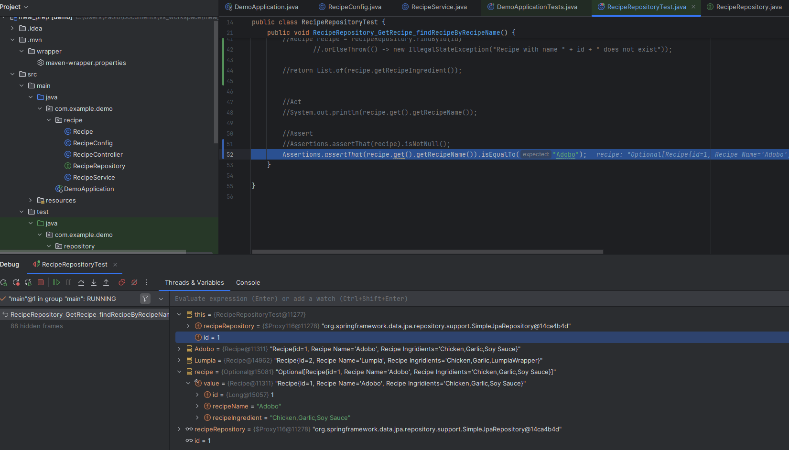

# Meal_Prep

## About

Using my SpringBoot template this is an app intended to help you prepare your weekly meals. 

Inteded Functionality:
  - Recipe book
  - Weekly meals planning
  - Weekly shop list generator

## Technology Stack

This project is built using the following technologies:

- **Frontend:** Nothing implemented yet...
- **Backend:** Java, SpringBoot, JUnit, Mockito
- **Database:** PostgreSQL, Spring Data JPA
- **DevOps & Deployment:** Not yet implemented
- **Other:** IntelliJ, VSCode 

## SpringBoot Annotations Utilised

A place to document all the annotations utilised - including any 
information relevant that is good to remember.

First one as this caused me grief...

### @GetMapping
`@GetMapping` is one of the five specified annotations for each HTTP request type.

1. `@GetMapping`
2. `@PostMapping`
3. `@PutMapping`
4. `@DeleteMapping`
5. `@PatchMapping`

As I have come to find out trying to implement a new method to 
get the ingredients for a given recipe. `@GetMapping` 
annotated methods is used to handle HTTP GET requests which can 
be paired with a given URI expression.

Initially, from the SpringBoot template we created the 
below which is automatically called if annotations are not added:

    @GetMapping()
        public List<Recipe> getrecipes() {
            return recipeService.getRecipes();
        }

What we've implemented below is the `@GetMapping` containing the annotations to map the
functionality to the method we created to retrieve the ingredients for a given recipe ID:

    @GetMapping("/getRecipe/{recipeId}")
        public List<String> getIngredients(@PathVariable Long recipeId) {
            return recipeService.getIngredients(recipeId); 
        }

### @Autowired
The feature of dependency injection allows for classes to be loosely
coupled with each other. In our example below we did this in the
RecipeController class loosely coupling it with the RecipeService
class. Allowing for methods within the RecipeController to call
an instance of RecipeService and call the methods within it without
having to instantiate the class or provide any parameters


Again we're using dependency injection below in the RecipeService 
class to loosely couple it with the RecipeRepository class
in order to use its data access functionality. This is functionality
that is standard to the data access class like saving changes,
finding by ID's but also to call our custom queries.


### @Repository
`@Repository` annotation is used to indicate the class that 
contains the mechanism for the data layer of the application. 
In our case RecipeRepository contains our two database queries
to access recipes and recipe ingredients. As we have come to know
from the image above, it contains preset functionality to 
retrieve, modify and delete data.


### @Service
`@Service` is used to indicate the service layer of an application. The service 
layer contains the business logic of the application. This annotation is a specialization 
of the `@Component` annotation, meaning that classes annotated with `@Service` are automatically
detected during the classpath scanning.

### @RestController
`@RestController` is a specialized version of `@Controller` which just allows the auto-detection of implementation classes,
`@Controller` is normally paired with `@ResponseBody` to arrange responses to JSON; whereas `@RestController` does this automatically
without the need for `@ResponseBody`. 

Below shows where this annotation has been used we've paired it with a specific `@ReqeuestMapping`
annotation to specify the path for each controller REST API requests. 




### @Configuration


### @Bean

## Unit Testing

Started to implement unit testing at the moment only created a unit test class for our repository (data access layer) but able to successfully test and debug:
 

Not entirely sure if this is how you're meant to test in that I had to create new instances of recipe by adding and populating our database with two recipes then 
manipulating that. It works for now but can do further research on this.

## Installation

Provide instructions on how to install and run the project locally.

```bash
# Clone the repository
git clone https://github.com/

```
